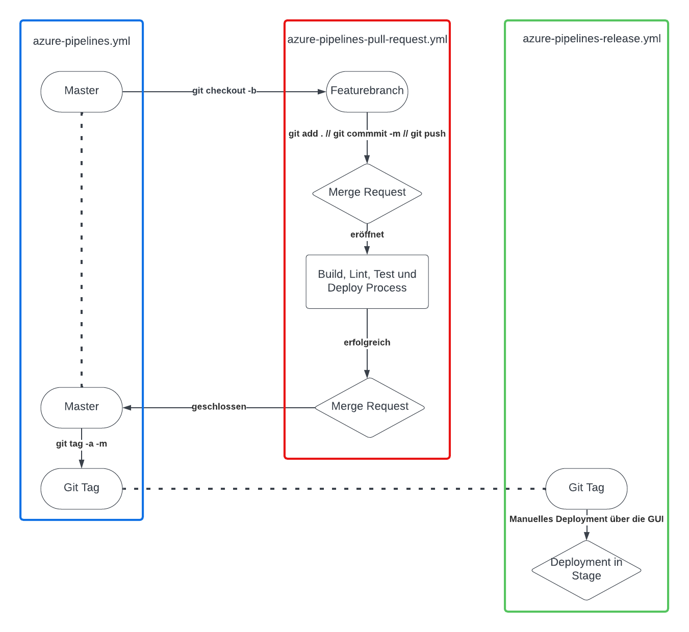
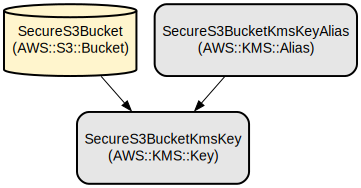

# Azure Pipelines CDK Sample Repository

This project demonstrates a secure S3 bucket deployment using AWS CDK with Azure Pipelines for CI/CD.

The repository contains a CDK application that creates a secure and encrypted S3 bucket. It leverages Azure Pipelines for continuous integration and deployment, ensuring that changes are thoroughly tested and validated before being applied to the infrastructure.

The project showcases best practices for infrastructure as code, including environment-specific configurations, automated testing, and secure deployment processes. It's designed to provide a robust starting point for teams looking to implement similar infrastructure management solutions.

## Repository Structure

```
.
├── app.py                              # Main CDK application entry point
├── azure_pipelines/                    # Azure Pipelines related modules
│   ├── load_env/                       # Environment loading utilities
│   ├── pull_requests/                  # Pull request handling modules
│   ├── setup_repo/                     # Repository setup utilities
│   ├── tests/                          # Tests for Azure Pipelines modules
│   └── logging_config.py               # Centralized logging configuration
├── cdk_sample_repo/                    # CDK stack definition
├── config/                             # Environment-specific configurations
├── tests/                              # Project-wide tests
├── azure-pipelines-*.yml               # Azure Pipelines configuration files
├── cdk.json                            # CDK configuration
├── requirements.txt                    # Project dependencies
└── requirements-dev.txt                # Development dependencies
```

## Usage Instructions

### Installation

Prerequisites:
- Python 3.7+
- Node.js 22.x
- AWS CLI configured with appropriate credentials
- Azure DevOps account with appropriate permissions

To set up the project:

1. Clone the repository:
   ```bash
   git clone <repository-url>
   cd <repository-name>
   ```

2. Install dependencies:
   ```bash
   pip install -r requirements.txt
   pip install -r requirements-dev.txt
   npm install -g aws-cdk@2.194.0
   ```

### Configuration

1. Set up environment-specific configurations in the `config/` directory.
2. Update `cdk.json` if necessary to adjust CDK settings.

### Deployment

To deploy the CDK stack:

1. Synthesize the CloudFormation template:
   ```bash
   cdk synth --context environment=developer
   ```

2. Deploy the stack:
   ```bash
   cdk deploy --context environment=developer
   ```

### Testing

Run unit tests:

```bash
pytest
```

### CI/CD Pipeline

The project uses Azure Pipelines for CI/CD. The pipeline is defined in `azure-pipelines-pull-request.yml` and includes the following stages:

1. CDK Synthesis and Validation
2. Unit Testing
3. Deployment to Developer Environment

To use the pipeline:

1. Set up an Azure DevOps project and link it to your repository.
2. Configure the pipeline using the provided YAML files.
3. Set up the necessary service connections and variables in Azure DevOps.



### Creating a Streamlined CDK App

To use this repository as a template for creating a streamlined CDK app, follow these steps:

1. Set up a Python virtual environment:
   ```bash
   python3 -m venv .venv
   ```

2. Activate the virtual environment:
   ```bash
   source .venv/bin/activate
   ```

3. Install the required dependencies:
   ```bash
   pip install -r requirements.txt
   pip install -r requirements-dev.txt
   ```

4. Set up the repository using the provided script:
   ```bash
   python3 azure_pipelines/setup_repo/setup_repo.py -pat "<YOUR_PAT_TOKEN>" -rn "<YOUR_REPO_NAME>"
   ```
   Replace "<YOUR_PAT_TOKEN>" with your Personal Access Token and "<YOUR_REPO_NAME>" with your desired repository name.

5. Install pre-commit hooks:
   ```bash
   pre-commit install
   ```

These steps will set up a new CDK project based on this template, including the necessary dependencies, repository structure, and pre-commit hooks for code quality checks.

### Pre-commit Hooks

This project uses pre-commit hooks to ensure code quality and consistency. The pre-commit hooks are defined in the `.pre-commit-config.yaml` file. To use these hooks, make sure you have installed the pre-commit package (included in `requirements-dev.txt`) and run `pre-commit install` as mentioned in the setup steps.

The following pre-commit hooks are configured:

1. **Black**: Formats Python code to ensure consistent style.
2. **Flake8**: Checks Python code for PEP8 compliance (with some exceptions).
3. **Pydocstyle**: Ensures compliance with Python docstring conventions.
4. **Isort**: Sorts Python imports.
5. **Pycln**: Removes unused imports.
6. **Pytest**: Runs Python unit tests on the `src/lambda/` directory.
7. **CDK Synth**: Compiles the AWS CDK code to ensure it is valid.
8. **Pre-commit-hooks**: Includes various checks such as trailing whitespace, YAML syntax, large files, and AWS credentials.

These hooks run automatically before each commit, helping to maintain code quality and catch potential issues early in the development process. If any hook fails, the commit will be blocked until the issues are resolved.

To run the pre-commit hooks manually on all files, use:

```bash
pre-commit run --all-files
```

This can be useful for checking your entire codebase or when you've made changes to the pre-commit configuration.

## Data Flow

The CDK application defines an S3 bucket with encryption and security settings. When deployed:

1. The CDK synthesizes CloudFormation templates.
2. Azure Pipelines executes the deployment process.
3. AWS CloudFormation creates or updates the S3 bucket with the specified configurations.
4. The S3 bucket is created with server-side encryption and public access blocked.

```
[CDK App] -> [CloudFormation Template] -> [Azure Pipelines] -> [AWS CloudFormation] -> [S3 Bucket]
```

## Infrastructure



The main infrastructure resource defined in this project is:

- AWS::S3::Bucket: A secure S3 bucket with server-side encryption and public access blocked.

Additional resources may include:

- AWS::KMS::Key: A KMS key for S3 bucket encryption (if custom encryption is configured).
- AWS::IAM::Role: IAM roles for managing access to the S3 bucket.

The exact resources and their configurations can be found in the `cdk_sample_repo_stack.py` file.